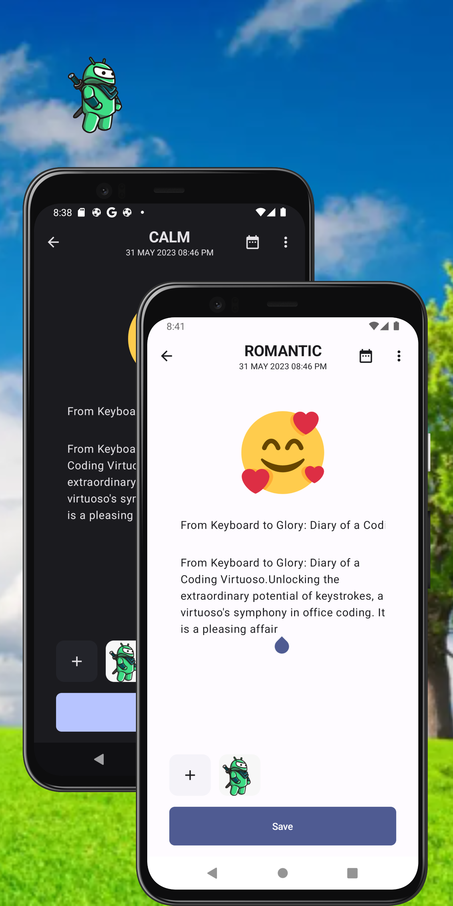

 

  

<h1 align = "center">
<b><i>xJournal</i></b>
</h1>

  

    Ứng dụng Android kiến trúc MVVM 
     

  
[Ảnh chụp màn hình](#camera_flash-screenshots-camera_flash) ~
[Thông số](#arrow_lower_right-deployment-arrow_lower_right) ~
[Kiến trúc](#hammer_and_wrench-architecture-hammer_and_wrench) ~
[Công nghệ](#building_construction-tech-stack-building_construction) ~ 
[Giấy phép](#scroll-license-scroll)  
 

    
xJournal cho phép người dùng viết và lưu các mục nhật ký với tùy chọn có thể bao gồm ảnh và biểu cảm được thể hiện bởi biểu tượng cảm xúc.
xJournal được xây dựng theo kiến trúc **Model-View-ViewModel** (MVVM) của Android Clean Architecture .

# :camera_flash: **Ảnh chụp màn hình** :camera_flash:

xJournal sử dụng Material 3 để có giao diện người dùng nhất quán:

<!--  &nbsp;&nbsp;&nbsp;&nbsp;
 &nbsp;&nbsp;&nbsp;&nbsp;   
 &nbsp;&nbsp;&nbsp;&nbsp;  -->

# :arrow_lower_right: **Thông số** :arrow_lower_right:
Các thông số chính của xJournal

| Thông Số       | Giá trị |
|----------------|---------|
| compileSdk     | 34      |
| targetSdk      | 34      |
| minSdk         | 26      |
| composeVersion | 1.5.1   |
| kotlinVersion  | 1.8.0   |

Để build và chạy ứng dụng, bạn cần cài đặt phiên bản Android Studio Iguana | 2023.2.1 hoặc mới hơn
# :hammer_and_wrench: **Kiến trúc** :hammer_and_wrench:

### Điều Hướng
Ứng dụng có tổng cộng :three: màn hình đích sử dụng phần điều hướng qua Compose để quản lý điều hướng.

| :tính năng:xác thực                | :tính năng:home                       | :tính năng:viết nhật ký           |
|-------------------------------------|-------------------------------------|-------------------------------------|
|  |  |  |

 - **Tính năng Xác thực**: Tính năng này tập trung vào việc xác thực và xác minh người dùng. Nó sử dụng Đăng nhập Google để đảm bảo rằng người dùng có thể truy cập an toàn vào các mục nhật ký của họ. Bằng cách xác thực người dùng, ứng dụng đảm bảo rằng chỉ những cá nhân được ủy quyền mới có thể tương tác với các nhật ký cá nhân của họ.

 - **Tính năng Trang chủ**: Tính năng Trang chủ chịu trách nhiệm hiển thị và lọc các mục nhật ký dựa trên ngày tháng. Nó cung cấp một giao diện thân thiện với người dùng để điều hướng qua các mục nhật ký và nhanh chóng lọc nhật ký theo các ngày cụ thể. Các lựa chọn bổ sung có thể được truy cập thông qua Ngăn Điều hướng.

 - **Tính năng Viết**: Tính năng Viết cho phép người dùng tạo các mục nhật ký mới hoặc chỉnh sửa các mục hiện có. Nó cung cấp một giao diện liền mạch và trực quan để người dùng ghi lại và tài liệu hóa những suy nghĩ, khoảnh khắc và kỷ niệm của họ. xJournal cho phép người dùng cá nhân hóa nội dung bằng cách thêm biểu tượng cảm xúc và hình ảnh kèm theo.

# :building_construction: **Công nghệ** :building_construction:

Project xJournal sử dụng nhiều thư viện và công cụ phổ biến trong Hệ sinh thái Android:

* [Jetpack Compose](https://developer.android.com/jetpack/compose) - bộ công cụ hiện đại để xây dựng giao diện người dùng Android gốc.
* [Android KTX](https://developer.android.com/kotlin/ktx) - giúp viết mã Kotlin ngắn gọn và thành ngữ hơn.

* [Coroutines and Kotlin Flow](https://kotlinlang.org/docs/reference/coroutines-overview.html) - được sử dụng để quản lý bộ nhớ cục bộ, tức là `ghi vào và đọc từ cơ sở dữ liệu`. Coroutine giúp quản lý các luồng nền và giảm nhu cầu gọi lại.
* [Material Design 3](https://m3.material.io/) - một hệ thống hướng dẫn, thành phần và công cụ có thể thích ứng để hỗ trợ hiển thị tốt nhất về thiết kế giao diện người dùng.
* [Compose Navigation](https://developer.android.com/jetpack/compose/navigation) - điều hướng giữa các thành phần kết hợp trong khi tận dụng các trạng thái của NavController giúp theo dõi ngăn xếp của các thành phần kết hợp tạo nên màn hình trong ứng dụng.
* [Dagger Hilt](https://dagger.dev/hilt/) - dùng cho Dependency Injection.
* [Coil](https://coil-kt.github.io/coil/) - thư viện tải hình ảnh dành cho Android được hỗ trợ bởi Kotlin Coroutines
* [SplashScreen API](https://developer.android.com/develop/ui/views/launch/splash-screen) - API SplashScreen cho phép ứng dụng khởi chạy kèm theo hoạt ảnh, bao gồm chuyển động trong ứng dụng khi khởi chạy, màn hình chờ hiển thị biểu tượng ứng dụng của bạn và quá trình chuyển đổi sang chính ứng dụng của bạn.

* [Room](https://developer.android.com/topic/libraries/architecture/room) thư viện cung cấp lớp trừu tượng trên SQLite để cho phép truy cập cơ sở dữ liệu mạnh mẽ hơn đồng thời khai thác toàn bộ sức mạnh của SQLite.
* [Mongo](https://www.mongodb.com/) - MongoDB là cơ sở dữ liệu NoSQL phổ biến, được sử dụng trong ứng dụng này để lưu trữ và quản lý dữ liệu liên quan đến các mục nhật ký. (được sử dụng trong branch main)
* [Firebase Storage](https://firebase.google.com/docs/storage/android/start) -  Firebase Cloud Storage là giải pháp lưu trữ đám mây đáng tin cậy và có thể mở rộng được sử dụng trong ứng dụng để lưu trữ và truy xuất ảnh liên quan đến các mục nhật ký.
* [Firebase Auth](https://firebase.google.com/docs/auth/android/start) - Xác thực Firebase cung cấp hệ thống xác thực an toàn và dễ sử dụng, cho phép người dùng đăng nhập và truy cập các mục nhật ký của họ một cách an toàn.
* [Max Keppeler's Sheet Compose Dialog](https://github.com/maxkeppeler/sheets-compose-dialogs) - F- Xác thực Firebase cung cấp hệ thống xác thực an toàn và dễ sử dụng, cho phép người dùng đăng nhập và truy cập các mục nhật ký của họ một cách an toàn.

* [Stevdza-San's MessageBarCompose](https://github.com/stevdza-san/MessageBarCompose) - Giao diện người dùng Thanh thông báo hoạt ảnh có thể được bao quanh nội dung màn hình của bạn để hiển thị thông báo Lỗi/Thành công trong ứng dụng của bạn. Nó được điều chỉnh và tối ưu hóa để sử dụng với các dự án Compose và Material 3.

* [Stevdza-San's OneTapCompose](https://github.com/stevdza-san/OneTapCompose) - Giao diện người dùng Thanh thông báo hoạt ảnh có thể được bao quanh nội dung màn hình của bạn để hiển thị thông báo Lỗi/Thành công trong ứng dụng của bạn. Nó được điều chỉnh và tối ưu hóa để sử dụng với các dự án Compose và Material 3.

# :scroll: **Giấy phép** :scroll:

MIT License

Copyright (c) [2023] [Stefan Jovanovic]

Permission is hereby granted, free of charge, to any person obtaining a copy
of this software and associated documentation files (the "Software"), to deal
in the Software without restriction, including without limitation the rights
to use, copy, modify, merge, publish, distribute, sublicense, and/or sell
copies of the Software, and to permit persons to whom the Software is
furnished to do so, subject to the following conditions:

The above copyright notice and this permission notice shall be included in all
copies or substantial portions of the Software.

THE SOFTWARE IS PROVIDED "AS IS", WITHOUT WARRANTY OF ANY KIND, EXPRESS OR
IMPLIED, INCLUDING BUT NOT LIMITED TO THE WARRANTIES OF MERCHANTABILITY,
FITNESS FOR A PARTICULAR PURPOSE AND NONINFRINGEMENT. IN NO EVENT SHALL THE
AUTHORS OR COPYRIGHT HOLDERS BE LIABLE FOR ANY CLAIM, DAMAGES OR OTHER
LIABILITY, WHETHER IN AN ACTION OF CONTRACT, TORT OR OTHERWISE, ARISING FROM,
OUT OF OR IN CONNECTION WITH THE SOFTWARE OR THE USE OR OTHER DEALINGS IN THE
SOFTWARE.
